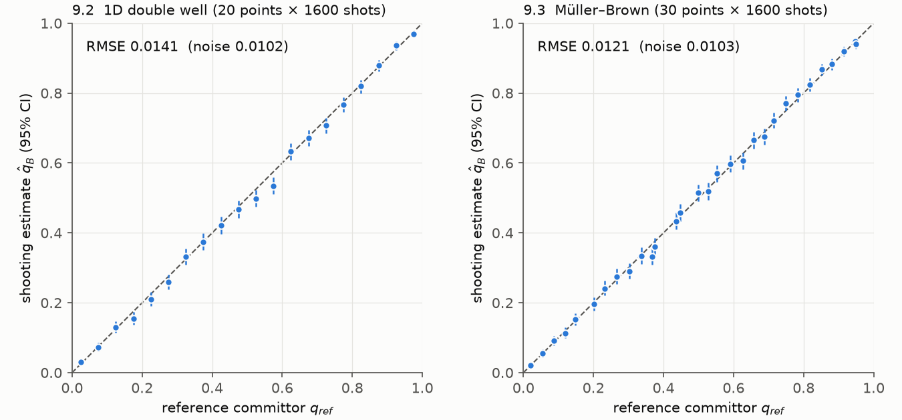
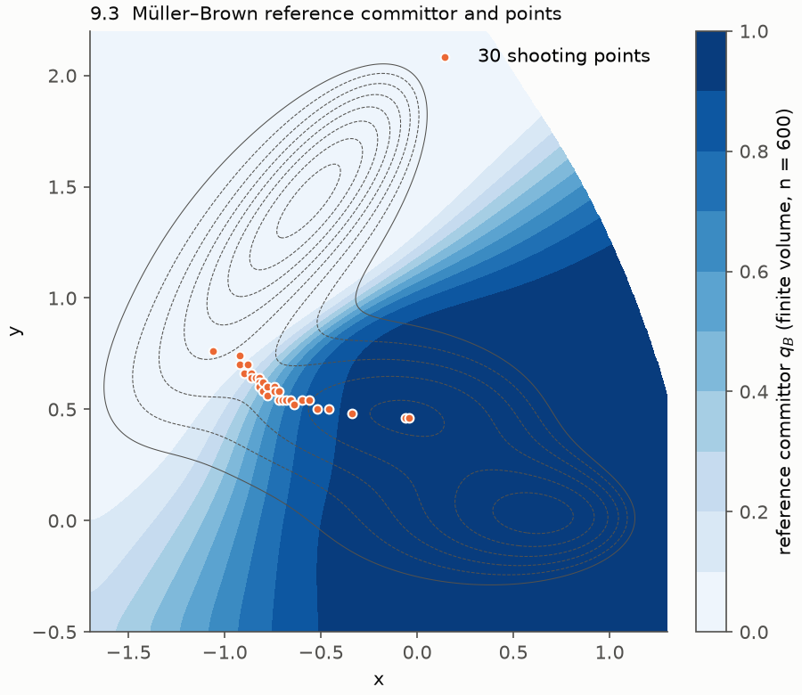

# A0 解析验收 part 1：自由扩散与双阱 committor（Task 9）

日期 2026-10-01，分支 `phase-a`。测试 `tests/test_acceptance_a0.py`（slow），算例在 `examples/toy_diffusion/` 和 `examples/toy_doublewell/`，参考解求解器在 `tests/reference/committor_ref.py`（单元测试 `tests/test_committor_ref.py`，13 项）。

运行命令：`CYTHEREA_A0_A0_WORKERS=32 pytest -m slow tests/test_acceptance_a0.py -v -s`。只用 CPU，32 进程，墙钟时间 22.8 min。

所有数字都来自真实引擎的完整链路：IC 采样器（含门禁）→ `run_batch`（`n_workers=32`，唯一写库方）→ `run_shot` 在线停止判据 → SQLite 记录库 → `estimate_kon` / `estimate_committor`，最后与精确解对比。全部用解析后端，约化单位，overdamped 动力学，D = kT/(mγ) = 1。

## 结论

| # | 内容 | 阈值 | 结果 | 判定 |
|---|---|---|---|---|
| 9.1 | 三维自由扩散 NAM，a = 1、b = 2、q = 8，N = 4000 | β∞ 与 a/b 的差 ≤ 3σ；dt 减半后不变 | dt：β∞ = 0.4881 ± 0.0080（z = −1.48）；dt/2：0.4984 ± 0.0080（z = −0.20）；dt 减半的变化为 +0.0102 ± 0.0113 | 通过 |
| 9.2 | 一维双阱，势垒 5 kT，20 个起点 | RMSE < 0.03 | RMSE = 0.0141（纯噪声期望 0.0102），每点 1600 发 | 通过 |
| 9.3 | 二维 Müller–Brown，30 个起点 | RMSE < 0.03 | RMSE = 0.0121（纯噪声期望 0.0103），每点 1600 发 | 通过 |
| 9.4 | 用 `offline_replay` 重算全部记录 | 100 % 一致 | 112 000 条记录、1.35 亿个观测点，0 处不一致 | 通过 |

## 9.1 自由扩散与 NAM 换算

起点均匀分布在 |r| = b 的球面上：1024 个 Fibonacci 格点作为等权帧，key 取 `frame_id = −1`，即按权重随机抽方向。反应区是 |r| ≤ a，逃逸面是 |r| = q（`BSurface`）。每一步都观测一次，dt_obs = dt。

| dt | 反应/逃逸/超时 | β | 有限 q 精确值 | 离散监测预测 | β∞（NAM） |
|---|---|---|---|---|---|
| 5e-4 | 1668 / 2332 / 0 | 0.4170 | 0.4286 | 0.4198 | 0.4881 ± 0.0080 |
| 2.5e-4 | 1708 / 2292 / 0 | 0.4270 | 0.4286 | 0.4223 | 0.4984 ± 0.0080 |

dt = 5e-4 时 β 偏低 1.2 %，方向和大小与离散监测偏差一致：只在离散时刻检查吸收面，会漏掉两次观测之间越过边界的情况，相当于把边界外移约 0.5826·√(2D·dt)（Broadie–Glasserman–Kou）。偏差量级是 O(√dt)，dt 减半后收敛到 a/b。σ 由 `estimate_kon` 的 Jeffreys 区间经 NAM 单调映射得到。

## 9.2 / 9.3 committor

- 起点：一维取参考 q 均匀分布在 0.025–0.975 的 20 个点（用 brentq 反解）；二维在过渡区按参考 q 分层，取 30 个点（见下图）。
- A、B 区都带 10 个观测间隔的持久性要求（τ_persist = 5e-3）。持久性会让参考解有一点偏移，实测最大只有 0.0016（一维）和 0.0009（二维）。
- 二维参考解用有限体积法解 backward Kolmogorov 方程。网格 n = 300 和 n = 600 在 30 个起点上的最大差为 1.5e-4。
- dt 减半抽查：每个维度各取 3 个点，每点 2000 发，dt 和 dt/2 各跑一次。差值都在 3σ 以内，dt/2 下的结果与参考解的差也在 3σ 以内。

| | RMSE | 纯噪声期望 | 最大残差 | 平均残差 | χ²/dof | 超时 |
|---|---|---|---|---|---|---|
| 9.2 一维 | 0.0141 | 0.0102 | 0.040 | −0.0065 | 36.7 / 20 | 0 |
| 9.3 二维 | 0.0121 | 0.0103 | 0.035 | +0.0008 | 37.1 / 30 | 0 |

一维的平均残差为 −0.0065，约 2.8σ（以 20 点平均的噪声计），χ² 也略大。这个偏差远小于阈值，来源没有进一步定位。可能的来源有两个：Euler–Maruyama 的 O(dt) 偏差，以及持久性判定与离散观测的交互。dt 减半抽查里没有看到显著变化。

### 偏离计划：每点 shot 数从 400 提高到 1600

计划写的是“20 个起点 × 400 shot、RMSE < 0.03”。第一次运行严格按计划，用固定种子，**9.2 没有通过**：RMSE = 0.0325，χ² = 48.1/20，第 11 点的残差为 −0.10（约 4σ）。9.3 当时通过，RMSE = 0.0238。

排查经过：
- 用新的随机流（其他 stage）在偏差最大的 4 个点上各补 2000 发，两轮的 z 值都在 −1.2 到 +1.1 之间，没有偏差。
- 用另外 4 个 stage 把整个 20 × 400 方案各重跑一遍，RMSE 为 0.015–0.023，χ² 为 13–26。
- 原 stage 重跑能逐位复现 0.0325。该 stage 下第 11 点的 400 条轨迹互不相同，没有共用噪声流。

结论：程序没有问题，是阈值和 shot 数的搭配不合适。400 发时纯噪声 RMSE 的期望是 0.0204，阈值 0.03 只是它的 1.5 倍，所以误判失败的概率不可忽略，固定种子正好落在了约 1/1000 的尾部。为此把 9.2 和 9.3 都改为每点 1600 发，噪声 RMSE 降到约 0.010，种子不变，阈值不变。没有采用换种子的办法，因为那等于挑一个能通过的种子。

## 9.4 离线回放

8 个记录库（9.1 两个，9.2、9.3 各三个）里的全部记录，都用一个新建的停止判据重新回放，逐条比较停止原因和 event_time，全部完全一致。

## 与计划不同的其他实现细节

- 起点放在同一个帧池里，key 的 `frame_id` 选点（约定 K3）。这样整个方案只有一个 protocol hash，`run_batch` 续算时可以校验（裁决 R39）。
- 9.1 的方向随机抽取，同一方向可能有好几发。`estimate_kon` 因此传了 `allow_clustered_frames=True`：自由扩散各向同性，结果与方向无关。
