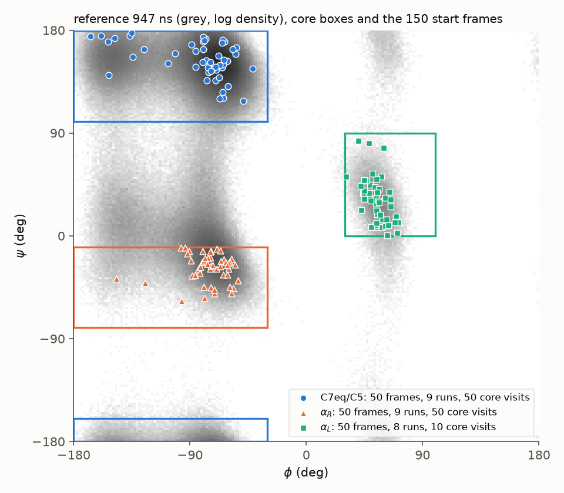
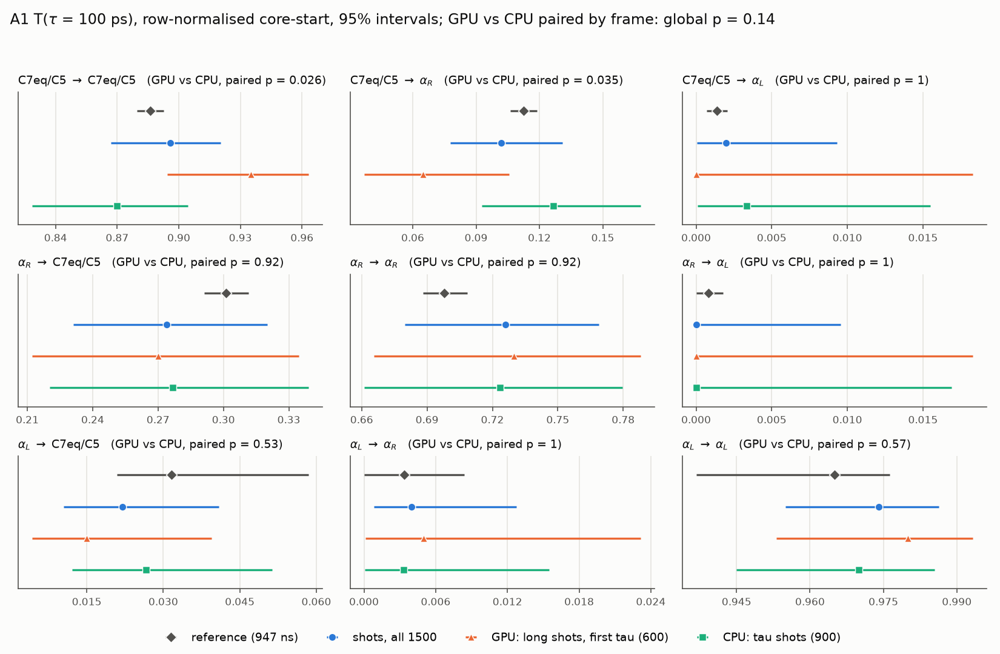
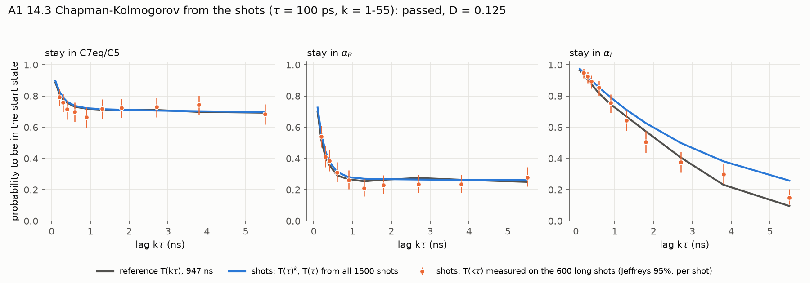
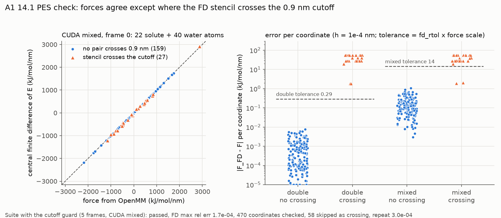
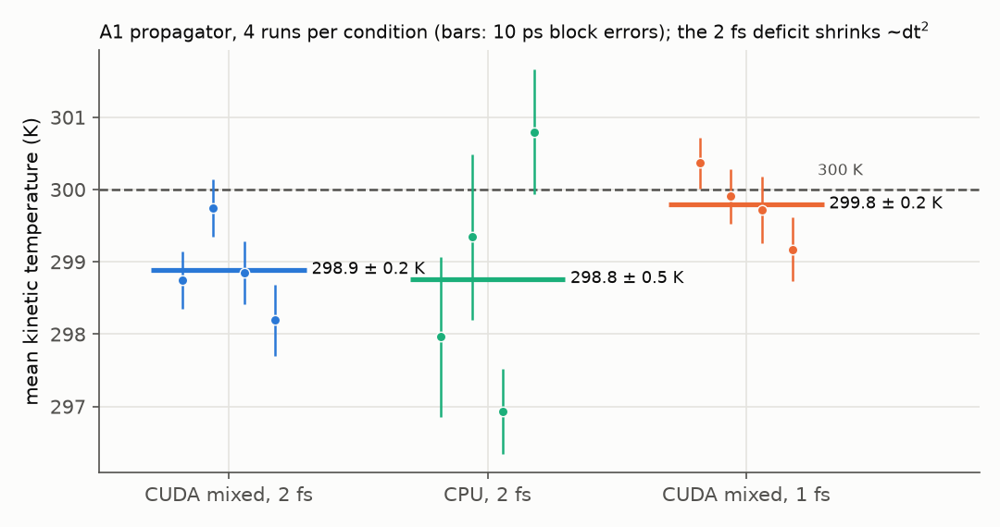

# A1 丙氨酸二肽验收：射击对参考（Task 14b）

日期 2026-10-04，分支 `phase-a`。参考数据见 14a（`examples/alanine_dipeptide/README.md` 第 3 节，`runs/ala2_par/analysis/analysis.json`）；射击脚本 `examples/alanine_dipeptide/shoot_a1.py`（`frames` / `configs` / `export` / `analyze` / `pes`），快速测试 `tests/test_ala2_shoot.py`；分析结果 `runs/ala2_shoot/analysis_14b.json`，PES 结果 `runs/ala2_shoot/pes_14_1.json`。

协议按计划 Task 14（2026-10-03 修订）：τ = 100 ps；状态 C7eq/C5、αR、αL 用 `ala2_common` 的 core 定义；终态用带初始标签的 TBA，φ/ψ 每 1 ps；比较行归一化的 core-start T(τ)；传播子与参考相同（LangevinMiddle，γ = 0.1 ps⁻¹，300 K，2 fs，HBonds + 刚性水）。

## 结论

| # | 内容 | 阈值 | 结果 | 判定 |
|---|---|---|---|---|
| 14.1 | `pes_consistency_suite`，CUDA mixed，sampled，溶质 FD | mixed 容差行 | FD 1.7e-4、单原子 3.4e-4（阈值 5e-3）；重复 3.0e-4（1e-3）；470 个坐标，58 个跨截断坐标跳过 | 通过（套件已加截断守卫，见下） |
| 14.2 | 射击 t2 落在参考 core-start t2 的 95% CI 内 | [1.51, 3.96] ns | t2 = 3.63 ns（射击 CI [2.37, ∞)）；t3 = 211 [178, 255] ps，参考 187 [179, 194] ps | 通过（宽松检验） |
| 14.3 | 射击数据自身的 CK，k = 1…55（horizon 5.5 ns ≈ 2·t2）；T(τ) 用全部 1500 发 | bootstrap 95% | D = 0.125，通过；最大偏差在 αL 长 lag | 通过 |
| 14.4 | 分界面 committor | 诊断 | 未做 | — |
| 14.5 | IC 拒绝率 | < 1% | 1500 发，0 次拒绝 | 通过 |
| 附 | 温控 | — | 运行中动能温度两平台一致；约 1 K 偏低随 dt² 缩小，是半步速度读数的偏差 | 正常 |

T(τ) 的 9 个元素，参考值全部落在射击的 95% 区间内。

## 实际跑的方案

用户 2026-10-03 批准的 12 h 方案（替代每帧 10 发 5.5 ns 的完整方案，8.25 μs）：

| 部分 | 内容 | 平台 | 量 | 墙钟 |
|---|---|---|---|---|
| 长 shot | 150 帧 × 4 发 × 5.5 ns（stage `a1_long`） | 181、183 两块 2080 Ti，各 4 进程 + MPS | 3.3 μs | 约 14 h |
| τ shot | 150 帧 × 6 发 × 100 ps（stage `a1_tau`） | 181、183 的 CPU，36 进程 × 4 线程 | 90 ns | < 13.5 h |

吞吐（GPU 空闲时实测）：2080 Ti 单进程约 1700 ns/天，MPS 4 进程合计约 3.2 μs/天（8 进程不再增加）；CPU 平台 20 进程 × 4 线程一台合计约 300 ns/天。

- T(τ)、ITS 和 CK 的 T(τ) 用全部 1500 发的第一个 τ（每帧 10 发）；CK 的 T(kτ)（k ≥ 2）只能用 600 发长 shot。
- 起始帧：每个状态 50 帧，取自参考 DCD（每 10 ps 一帧）中 raw core label ≥ 0 的帧（每条轨迹跳过 10 ns 预平衡），在按时间排序的候选上做带随机起点的等距抽样。从帧坐标重算的 φ/ψ 与参考记录差 ≤ 0.002°。分子整体平移回盒，IC 门禁投影约束、按最小镜像检查 `min_pair_dist`、重抽 Maxwell–Boltzmann 速度。
- 帧的分散：C7eq/C5 和 αR 各 50 帧来自 9 条轨迹的 50 次 core 访问；**αL 的 50 帧只来自 8 条轨迹的 10 次访问**（参考里 αL 交换只有约 12 次）。

- 库的读取：每个分片的 SQLite 只归写它的主机（S3），在各自主机上用 `shoot_a1.py export` 导出 JSONL，分析读导出文件（导出 600 + 900 条，与写入数一致）。

## T(τ)

| from \ to | C7eq/C5 | αR | αL |
|---|---|---|---|
| C7eq/C5 射击 | 0.896 [0.867, 0.921] | 0.102 [0.078, 0.131] | 0.002 [0.0001, 0.009] |
| C7eq/C5 参考 | 0.886 [0.880, 0.893] | 0.113 [0.106, 0.119] | 0.0014 [0.0007, 0.0020] |
| αR 射击 | 0.274 [0.231, 0.320] | 0.726 [0.680, 0.769] | 0 [0, 0.010] |
| αR 参考 | 0.301 [0.291, 0.311] | 0.698 [0.688, 0.708] | 0.0008 [0, 0.0018] |
| αL 射击 | 0.022 [0.011, 0.041] | 0.004 [0.0008, 0.013] | 0.974 [0.955, 0.986] |
| αL 参考 | 0.032 [0.021, 0.058] | 0.0034 [0, 0.0084] | 0.965 [0.937, 0.976] |

射击区间是行归一化估计的 Jeffreys 区间，以帧为 cluster；n_eff 每行 C7eq 500、αR 384、αL 369–500（每态 500 发）。以 core 访问为 cluster（110 个访问）时区间几乎不变（αL→C7eq [0.012, 0.038]），所以 αL 帧集中在 10 次访问里没有明显放大方差。参考区间是 block bootstrap。

**GPU 与 CPU 两部分的对照**（`runs/ala2_shoot/paired_platform.json`）：每帧有 4 发 GPU（长 shot 的第一个 τ）和 6 发 CPU（τ shot），在每帧内部置换平台标签（20 000 次），检验两部分的 T_ij 差。9 个元素取最大差的整体检验 **p = 0.14**，没有平台效应的证据。单看 C7eq 这一行：C7eq→αR 的差为 −0.062（GPU 0.065，CPU 0.127），p = 0.035；C7eq→C7eq 为 +0.065，p = 0.026（同一行的两面）；其余元素 p ≥ 0.5。9 个元素里有一行在 0.05 附近，与多重比较下的偶然相符。以每态 200/300 发的规模，排除不了约 0.05 以下的平台差异。两平台的温度和 IC 一致（见温控）。

## ITS（14.2）

reversible MLE（只用于时间尺度）：t2 = 3.63 ns，95% CI [2.37 ns, ∞)；t3 = 211 ps [178, 255]。行归一化 T 的 ITS 为 3.59 ns / 212 ps。参考 core-start（τ = 100 ps）：t2 = 2.72 ns [1.51, 3.96]，t3 = 187 ps [179, 194]。

t2 是 αL 交换，参考里只有约 12 次事件，射击 T(τ) 的 αL 行又只有 10 次访问的帧，所以 t2 两边都很宽，射击区间上界无界。14.2 通过，但只是宽松检验。

## CK（14.3）

`ck_test_shots`：T(kτ) 与 T(τ)^k 都只用 t = 0 出发的窗口，统计量 D = max |T(τ)^k − T(kτ)|，按起始状态分层、以帧为单位的 bootstrap（500 次；一帧的长 shot 和 τ shot 一起抽）。k 取参考 CK 的同一组：1、2、3、4、6、9、13、18、27、38、55。**T(τ) 用全部 1500 发**（用户 2026-10-04 决定），T(kτ)（k ≥ 2）用 600 发长 shot。

结果 **D = 0.125，通过**。C7eq 和 αR 的预测与实测、参考在整个 5.5 ns 上重合；最大偏差在 αL：k = 27 时预测 0.50、实测 0.375，k = 55 时 0.26 vs 0.15。实测的 αL 停留贴着参考曲线走，偏高的是预测，即 T(τ) 的 αL 停留 0.974（参考 0.965）连乘后放大；这和射击 t2（3.63 ns）比参考（2.72 ns）长是同一件事，αL 行只有 10 次 core 访问的帧，统计上仍在区间内。

检验的性质（合成数据，50 帧 × 4 发长 shot + 6 发 τ shot，k = 1…20）：Markov 链通过率 0.94；带隐藏记忆的 lumped 链通过率 0.12（只用长 shot 估 T(τ) 时为 0.28）。最早只用 600 发长 shot 估 T(τ) 时 D = 0.20，也判通过，但 C7eq 停留 0.935、αL 0.980 的抽样误差连乘后使预测整体偏离，检验力弱，故改用全部 shot。

## PES（14.1）

第一次按原套件跑不通过（FD 1.65e-2 > 5e-3）。诊断（CUDA double 与 mixed，同一帧，186 个坐标）：
- 换 double 精度 FD 误差不变，不是精度问题。
- 体系是 PME + 0.9 nm 直接截断、无 switching，能量在截断处有约 0.005 kJ/mol 的跳变。FD 位移（±1e-4 nm）让原子对跨过截断的 27 个坐标误差 28–56 kJ/mol/nm；其余 159 个坐标与力吻合，相对误差 double 2.6e-6、mixed 3.8e-4。
- mixed 下同一位置第一次求值与之后不逐位一致（3e-4，按套件的度量），double 下 7e-10。

为此改了 `cytherea.backends.pes_suite`（用户 2026-10-04 决定）：后端可选声明 `energy_cutoffs()`（OpenMM 后端从带截断的非键力读出截断与默认盒），FD 坐标的位移可能让某对原子跨过截断时跳过并计数，不进误差和噪声底；`repeat_rtol` 改为按精度给默认值（double 逐位，mixed 1e-3，single 5e-3）。新测试见 `tests/test_pes_suite.py`、`tests/test_openmm_backend.py`。改后 14.1 通过（上表）。

## 温控

`runs/ala2_shoot/thermo/`，183，从 4 个起始帧各跑一条，丢掉前 20 ps，自由度 4929（3N − 约束 − 3）：

| | 平均动能温度 |
|---|---|
| 1500 发的起始速度 | GPU 299.9 ± 0.2 K，CPU 299.4 ± 0.2 K（涨落 5.9–6.0 K，理论 6.0 K） |
| CUDA mixed，dt = 2 fs，4 × 480 ps | 298.9 ± 0.2 K |
| CPU，dt = 2 fs，4 × 100 ps | 298.8 ± 0.5 K |
| CUDA mixed，dt = 1 fs，4 × 480 ps | 299.8 ± 0.2 K |

dt 减半后偏低从 1.1 K 降到 0.2 K，约为 1/5（dt² 预期 1/4）：这是 LangevinMiddle 报告的速度与位置差半步造成的读数偏差，构型采样不受影响。两平台一致。

## 偏离计划与待办

- 参考用 10 条独立轨迹共 947 ns（原始 1037 ns），代替“一条 ≥ 1 μs”（用户 2026-10-03 确认）。
- 每帧 10 发里只有 4 发跑满 5.5 ns，6 发只跑 τ（12 h 预算，用户 2026-10-03 批准）；τ shot 在 CPU 平台上跑，physics_config_hash 与 GPU 部分不同，分开存放、分开报告。
- 14.1 的套件加了截断守卫和按精度的重复容差（见上）。
- 14.3 的 T(τ) 用全部 1500 发（用户 2026-10-04 决定；`ck_test_shots` 新增 `tau_only`）。
- 待做：14.4 分界面 committor（30 帧 × 100 发，预算另报）。

图由 `examples/alanine_dipeptide/report_figures.py` 生成（A1_frames、A1_T、A1_thermo，以及 A3 的 A3_pilot）；A1_ck、A1_pes 由本次分析时的脚本直接画出，数据在 `runs/ala2_shoot/analysis_14b.json`、`pes_cutoff_diag_{double,mixed}.json`。
