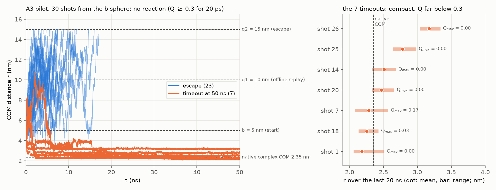

# A3 pilot：中断核对、续跑与 30 发结果（2026-10-03 / 04）

对应审查交接 `review_handoff_2026-10-03.md` 的 BUG-01、BUG-02、BUG-03 与 TODO-01/02。

## 1. 已确认的事实

库：`runs/a3/pilot.sqlite`（owner_host = `kasuga`，即 180；schema 2）。核对方法：在 kasuga01 上用 `dd iflag=direct` 拷到 scratch，以 `mode=ro&immutable=1` 只读查询；`integrity_check` = ok，无 hot journal。

| 项目 | 结果 |
|---|---|
| 已提交记录 | **14 发**（shot_id 0–13，stage `pilot`，global_seed 20261002） |
| 结果 | 12 escape，2 timeout，0 reaction，0 nonfinite |
| failures 表 | 空 |
| 最后一次成功写入 | 库文件 mtime 2026-10-02 23:50（shot 13）；第 15 发在 2026-10-03 03:15 写库时失败 |
| code_version | 全部 `0.1.0+src.15357c3e671a` |
| physics_config_hash | 全部 `f2a4d0a4…` |
| protocol_hash | 全部 `a876f340…` |
| 原进程 | 180 上 PID 14736 已不存在 |

日志只每 5 发打一行，所以只显示了 10 发；库里实际是 14 发。

## 2. BUG-01：中断原因

traceback 停在 `Store.append` → `_raw_connect`：`unable to open database file`，脚本与源码路径都是 `/home/ruigengji/venus-ng/...`。更名后 `/home/ruigengji/venus-ng` 在 kasuga01 和 180 上都已不存在：作业的工作目录和相对 store 路径随之失效，SQLite 打不开库（也无法在原目录建 journal）。更名后的目录在两台机器上都可写（`test -w` 通过），排除了权限问题。

续跑用绝对路径传 `--store`。

## 3. BUG-02：跨版本续算的核对

`15357c3e671a` 对应旧仓库提交 `87530ea`（按 `code_version()` 的算法对旧提交的 `src/` 重算 hash，结果一致）。它与当前代码之间只有两类改动：

- `be263e6`（修复包）：`run_shot` 把 `InitialState.origin_label` 写入记录（旧记录为 None，新记录为 (0, 0)）；`EncounterSampler` 新增“两池帧温度一致”的构造期检查，组合帧温度改取池的共同温度。三者都不改动力学、IC 抽样或 RNG 流；本 pilot 的帧温度全部是 300 K，新检查通过。
- 更名：把旧 `500be68` 的 `src/` 中 venus_ng/venus-ng 替换为 cytherea 后，与当前 `src/cytherea` 逐文件比较，只差 `__init__.py` 的一行 docstring。**唯一的数据兼容问题**是帧文件格式标记 `venus-ng-frames/1`：当前 `load_frames` 拒读 `runs/a3/frames/*.npz`，已修复（接受旧标记，写出仍用新标记；测试 `test_load_frames_reads_files_written_before_the_rename`）。

用当前代码构建 pilot 的 shot 函数，算出的 physics_config_hash 与 protocol_hash 与库中完全相同。因此续跑用 `run_batch(allow_code_change=True)`：只放宽 code identity，physics/protocol 仍逐发核对；没有使用 `allow_config_change`。`shoot.py shoot` 为此新增 `--allow-code-change`。

迁移 provenance：shot 0–13 的 code_version 为 `src.15357c3e671a`，origin_label 为 None；续跑的 shot 14–29 带 code_version `0.1.0+src.bf9ac90c9a9b`（2026-10-03 的工作树：本文件所述两项修复，提交前）与 origin_label (0, 0)；续跑时 run_batch 只报告了 code_version 不一致。A3 分析不使用 origin_label。

## 4. BUG-03：差值区间的修正

原 `diff_interval` 对 3×3 配对表全部 9 格用 Dirichlet(counts + 1/2)，给 4 个不可能的格子分配了概率。改为按 q1 → q2 的结构建模：

- q1 结局 (reaction, escape, other) ~ Dirichlet(n + 1/2)；
- 只有 q1 escape 会继续，其在 q2 的结局 ~ Dirichlet(m + 1/2)；
- q1 reaction 必为 q2 reaction，q1 other 必为 q2 other；观测到其他配对直接 `ValueError`。

这样 β(q1) 的后验正好是 Beta(n_R + 1/2, n_E + 1/2)，与单侧 `estimate_kon` 的 Jeffreys 一致；β(q2) = (r1 + e1ρ)/(r1 + e1(ρ+ε))。区间是等尾 95% Bayesian credible interval，不是频率学置信区间；输出另给均匀先验下的区间（`diff_ci95_uniform_prior`）作先验敏感性。`valid` 仍由两侧 `estimate_kon` 决定（nonfinite 或 timeout > 5% 即 False）。

已知真值的覆盖率（30 发/重复，1000 次重复）：

| q1 结局 (R, E, O) | 续行 (R, E, O) | 真差值 | Jeffreys | 均匀 |
|---|---|---|---|---|
| (0.03, 0.95, 0.02) | (0.02, 0.97, 0.01) | +0.0145 | 0.988 | 0.972 |
| (0.30, 0.68, 0.02) | (0.20, 0.79, 0.01) | +0.0803 | 0.947 | 0.956 |
| (0.01, 0.98, 0.01) | (0.00, 0.99, 0.01) | −0.0048 | 1.000 | 1.000 |

稀有反应时偏保守，常见反应时接近名义值。

## 5. 现有 14 发的分析（修正后的方法）

| | q2 = 15 nm | q1 = 10 nm |
|---|---|---|
| reaction / escape / timeout | 0 / 12 / 2 | 0 / 12 / 2 |
| β（Jeffreys 95%） | 0 [0, 0.185] | 0 [0, 0.185] |
| β∞ 95% | [0, 0.254] | [0, 0.313] |
| valid | **False**（timeout 14% > 5%） | False |

β∞(q2) − β∞(q1)：Jeffreys [−0.041, 0.233]，均匀 [−0.036, 0.280]；少于 5 个 reaction，区间由先验主导。停止时间中位数 7.2 ns，p90 39.8 ns，14 发共 181 ns。

**两发 timeout 的性质**：shot 1 和 shot 7 分别在 1.9 ns 和 0.2 ns 后进入 r < 3 nm，此后 96%–100% 的时间停在 r ≈ 2.1–2.3 nm（天然复合物 COM 距离 2.35 nm），Q 始终 ≤ 0.17（shot 1 为 0）——是紧密的**非天然复合物**，50 ns 内既不解离也不转为天然界面。这是正式规模前要定的协议问题（t_max、反应判据，或 GBn2 下非特异结合是否过稳），不是 timeout 偶然偏多。

## 6. 续跑

2026-10-03 15:35 在 180 上续跑剩余 16 发（shot 14–29，PID 23696），命令见 `docs/STATUS.md`。按已有速率（escape 约 0.5 h/发，timeout 约 3.3 h/发，timeout 比例约 14%）估计约 15–20 h。

## 7. 30 发的最终结果（2026-10-04）

续跑于 2026-10-04 14:47 完成（PID 23696 已退出）。库里 30 条记录、failures 表为空：shot 0–13 的 code_version 为 `src.15357c3e671a`，shot 14–29 为 `src.bf9ac90c9a9b`，physics/protocol hash 全部一致。分析在 180 上跑（`shoot.py analyze`，修正后的差值区间），结果 `runs/a3/pilot_analysis.json`。

| | q2 = 15 nm | q1 = 10 nm |
|---|---|---|
| reaction / escape / timeout | 0 / 23 / 7 | 0 / 24 / 6 |
| β（Jeffreys 95%） | 0 [0, 0.102] | 0 [0, 0.098] |
| β∞ 95% | [0, 0.146] | [0, 0.179] |
| valid | **False**（timeout 23% > 5%） | False |

β∞(q2) − β∞(q1)：Jeffreys [−0.023, 0.137]，均匀 [−0.023, 0.176]；没有 reaction，区间由先验主导。停止时间中位数 7.4 ns，p90 = 50 ns（t_max），30 发共 519 ns。

**7 发 timeout**：

| shot | 最后 20 ns 的 r（nm） | Q 最大值 | r < 3 nm 的时间比例 |
|---|---|---|---|
| 1 | 2.18 | 0.00 | 96% |
| 7 | 2.28 | 0.17 | 100% |
| 14 | 2.51 | 0.00 | 78% |
| 18 | 2.25 | 0.03 | 96% |
| 20 | 2.47 | 0.00 | 65% |
| 25 | 2.78 | 0.00 | 97% |
| 26 | 3.17 | 0.00 | 0% |

6 发停在 r ≈ 2.2–2.8 nm、几乎没有天然接触的紧密复合物里（天然复合物 COM 距离 2.35 nm），50 ns 内既不解离也不转为天然界面；shot 26 在 r ≈ 3.2 nm 附近徘徊。q1 = 10 nm 时少一发 timeout：有一发在 q2 下超时、但先越过了 10 nm。

**结论**：按当前协议（GBn2、Q ≥ 0.3 持续 20 ps 为反应、t_max = 50 ns），pilot 给不出有效的 β：非特异结合使 timeout 占 23%，而 30 发里没有一次反应，β 只有上界。正式规模（16.3/16.4）前要先定协议：延长 t_max、改反应判据，还是先检查 GBn2 下非特异结合是否过稳。这一项待用户决定。
